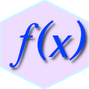

# CoreMathSharp

Accurate, portable, and deterministic implementations of mathematical functions

<a href="https://www.nuget.org/packages/AndanteSoft.CoreMathSharp"></a>
<a href="LICENSE"></a>
<a href="https://www.nuget.org/packages/AndanteSoft.CoreMathSharp"></a>



## Basic Usage

```cs
// All functions are accessible via StrictMath(F)
double exp = StrictMath.Exp(123.0);
float logf = StrictMathF.Log(123.0f);
```

## Install

CoreMathSharp can be installed from NuGet `AndanteSoft.CoreMathSharp`.

```
dotnet add package AndanteSoft.CoreMathSharp
```

CoreMathSharp requires **.NET Standard 2.1** or **.NET 10.**
All functions are available in both, but the .NET 10 version is recommended as it runs faster.

### Installing on Unity

Supported version: 2021.2 or later. (API Compatibility Level: .NET Standard 2.1)

My test environment is 6000.5.0a5.

Use [NuGetForUnity](https://github.com/GlitchEnzo/NuGetForUnity) to install.

## Features

### TL;DR

* **Completely accurate.** All functions perform mathematically correct calculations and return correctly rounded results.
* **Environment independent.** `Math(F)` are environment dependent. CoreMathSharp is environment independent and produces correct results everywhere.
* **Reproducible.** Correct results are obtained in any environment, making it suitable for game replays and scientific and technical simulations.
* **Portability.** Works in .NET Standard 2.1 environments (i.e. Unity).
* **Easy to use.** Usage is the same as `Math(F)`. Some mathematical functions not found in `Math(F)` are also implemented.
* **Fully managed.** No native implementation.

### Why not use `Math(F)` ?

For example, [`Math.Sin`](https://learn.microsoft.com/en-us/dotnet/api/system.math.sin?view=net-10.0) has the following note:

> This method calls into the underlying C runtime, and the exact result or valid input range may differ between different operating systems or architectures.

[The help](https://learn.microsoft.com/en-us/cpp/c-runtime-library/floating-point-support?view=msvc-170) for the "underlying C runtime" says:

> The floating-point functions are implemented to balance performance with correctness. Because producing the correctly rounded result may be prohibitively expensive, these functions are designed to efficiently produce a close approximation to the correctly rounded result. In most cases, the result produced is within +/-1 ULP (unit of least precision) of the correctly rounded result, though there may be cases where there's greater inaccuracy.
> ...
> Many of the floating-point math library functions have different implementations for different CPU architectures. 

Also, for example, Unity's [`Mathf.Sin`](https://docs.unity3d.com/ScriptReference/Mathf.Sin.html) has this note:

> If using very large numbers with this function, there is an acceptable range for input angle values for this method, beyond which the calculation will fail. On windows, the acceptable range is approximately between -9223372036854775295 to 9223372036854775295. This range may differ on other platforms. For values outside of the acceptable range, the Sin method returns the input value, rather than throwing an exception.

This information tells us:

* Not accurate. In most cases the error is ±1 [ulp](https://en.wikipedia.org/wiki/Unit_in_the_last_place), so I don't think it's a problem, but...
* It is environment-dependent, which is problematic for terrain generation in games and for reproducibility in scientific papers.
* Not portable. It is heavily dependent on specific platforms (CRT, libm, etc.) and cannot be perfectly consistent across different platforms.

But what if there was a "perfect" mathematical function?
Perfection - accurate down to the last bit - necessarily means that the same value would be obtained in any environment.


### Functions

The following functions are available:

|         Function | float | double |
|-----------------:|------:|-------:|
|              Abs |    ✅ |     ✅ |
|             Acos |    ✅ |     ✅ |
|            Acosh |    ✅ |     ✅ |
|           AcosPi |    ✅ |     ✅ |
|             Asin |    ✅ |     ✅ |
|            Asinh |    ✅ |     ✅ |
|           AsinPi |    ✅ |     ✅ |
|             Atan |    ✅ |     ✅ |
|            Atan2 |    ✅ |     ✅ |
|          Atan2Pi |    ✅ |     ✅ |
|            Atanh |    ✅ |     ✅ |
|           AtanPi |    ✅ |     ✅ |
|             Cbrt |    ✅ |     ✅ |
|         CopySign |    ✅ |     ✅ |
|              Cos |    ✅ |     ✅ |
|             Cosh |    ✅ |     ✅ |
|            CosPi |    ✅ |     ✅ |
|              Erf |    ✅ |     ✅ |
|             Erfc |    ✅ |     ✅ |
|              Exp |    ✅ |     ✅ |
|             Exp2 |    ✅ |     ✅ |
|           Exp2M1 |    ✅ |     ✅ |
|            Exp10 |    ✅ |     ✅ |
|          Exp10M1 |    ✅ |     ✅ |
|            ExpM1 |    ✅ |     ✅ |
| FusedMultiplyAdd |    ✅ |     ✅ |
|            Hypot |    ✅ |     ✅ |
|           LGamma |    ✅ |     ✅ |
|              Log |    ✅ |     ✅ |
|            Log1P |    ✅ |     ✅ |
|             Log2 |    ✅ |     ✅ |
|           Log2P1 |    ✅ |     ✅ |
|            Log10 |    ✅ |     ✅ |
|          Log10P1 |    ✅ |     ✅ |
|              Max |    ✅ |     ✅ |
|              Min |    ✅ |     ✅ |
|              Pow |    ✅ |     ✅ |
|   ReciprocalSqrt |    ✅ |     ✅ |
|              Sin |    ✅ |     ✅ |
|           SinCos |    ✅ |     ✅ |
|             Sinh |    ✅ |     ✅ |
|            SinPi |    ✅ |     ✅ |
|             Sqrt |    ✅ |     ✅ |
|              Tan |    ✅ |     ✅ |
|             Tanh |    ✅ |     ✅ |
|            TanPi |    ✅ |     ✅ |
|           TGamma |    ✅ |     ✅ |


### Performance

WIP

## Notes

In a 32-bit environment (where the x87 FPU is used because SSE2 cannot be used for calculations), correct results may not be obtained.
This is unavoidable due to the [C# specifications](https://learn.microsoft.com/en-us/dotnet/csharp/language-reference/language-specification/types#837-floating-point-types), so it cannot be supported.

> Floating-point operations may be performed with higher precision than the result type of the operation. 
> ...
> Some hardware architectures support an “extended” or “long double” floating-point type with greater range and precision than the `double` type, and implicitly perform all floating-point operations using this higher precision type.

## Fork

### Build

```
dotnet build
```

### Run Tests

```
dotnet test
```

To generate test vectors (such as `acosf.txt`), see the folder under `c/acosf.c`.
An environment where clang can run (WSL) is required.

### Run Benchmarks

```
dotnet run -c Release --project CoreMathSharp.Benchmarks
```

### Publish

```
dotnet pack
```

## License

[MIT License](LICENSE)

The implementation of CoreMathSharp is a port of the implementation in [THE CORE-MATH project](https://core-math.gitlabpages.inria.fr/).
I would like to take this opportunity to express my gratitude.

## TODO

* Benchmarking
    * Managed (vs. `Math(F)`)
    * IL2CPP (vs. `Mathf` or `Unity.Mathematics`)
    * vs. BurstCompile
    * Compare with P/Invoke
* More accurate testing
    * measure code coverage
* Add Document Comment


